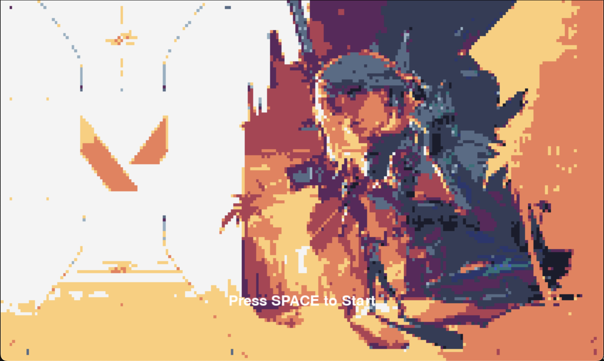
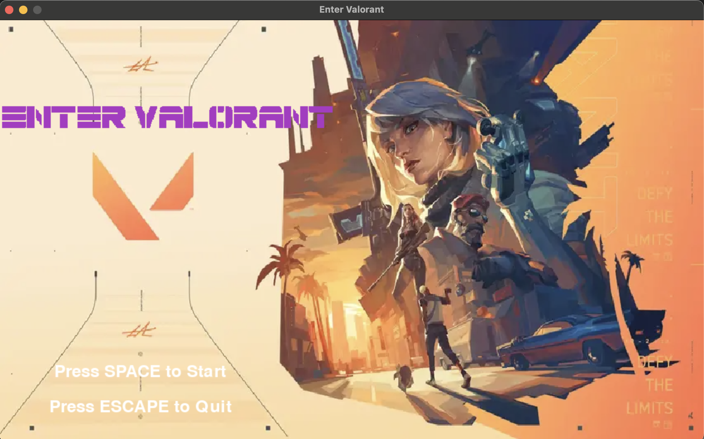

# Enter Valorant
## CS110 Final Project Spring, 2024

## Team Members

none

***

## Project Description

I want to make a Enter the Gungeon style game where the character you pick are from Valorant. You will play as Jett and be able to use her basic abilities as well has have the art style of Enter the Gungeon.

***    

## GUI Design

### Initial Design

### Final Design

## Program Design

### Features

1. Agent Selection - where you pick the agent (Jett)
2. Moveable Character - The agent(Jett) can be controlled to move left right and at an angle
3. Shoot - You would be able to shoot a gun at the direction you click
4. Changing Backgrounds - you are able to move between screens
5. Game Completed Screen - when you complete the level, the game ends with a screen

### Classes

- Class Controller: controls what game state the game is in from Menu, Agent Selection, Game, and Gameover mode. In each of the game states you can do certain things and can go between the states.
- Class Jett: initializes Jett's attributes like her speed, animation, gun, size and abilities. Additionally, it is also where her movement controls, shooting mechanics, abilities and animations are.
- Class Classic: initializes the gun Classic's attributes like its shooting speed and sprites.
- Class Bullet: initializes the bullet's attributes of the Classic gun like the speed and size. It also controlls the direction that the bulllets shoots and where it comes out of from the gun sprite.
- Class Room: initializes the background, boundaries, obstacles and componenets of the rooms.
- Class gameController: initializes the room backrounds themselves as well as control room changes. Also create the components of the rooms like the signs, dummies and how Jett interact with the rooms.

## ATP

Test Case 1: Player Movement
-----------------------------
- Test Description: Verify that the player can move in all directions including diagonals
- Test Steps:
    1. Start game by pressing SPACE
    2. Move left and right with A and D respectively
    3. Move up and down with W and S respectively
    4. Move diagonals with A+W, D+W, A+S, and D+S
- Expected Outcome: The players moves in the appropriate direction and changes sprite thats corresponds with the directions

Test Case 2: Dash Ability
---------------------------
- Test Description: Verify that the player can use her dash ability
- Test Steps:
    1. Start game by pressing SPACE
    2. To use her dash ability press E
    3. The direction of the dash corresponds with the WASD keys
    4. Verify that the player moves in a specific direction quickly
    5. Verify that the sprite changes with dash
    6. Ensure that there is a slight cooldown between dashes
    7. Verify that the player can go in all 8 directions
- Expected Outcome: When utilizing her ability, the player should move very quickly towards the direction they are moving towards

Test Case 3: Updraft Ability
-----------------------------
- Test Description: Verify that the player can use her updraft ability
- Test Steps:
    1. Start game by pressing SPACE
    2. To use her updraft ability press Q
    3. Verify that she moves up and comes back down
    4. Verify that she becomes slightly transparent
    5. Verify the updraft sprite plays
    6. Ensure that there is a slight cooldown between updrafts
- Expected Outcome: When utilizing her updraft ability, she moves up and then down while being transparent and changes sprite.

Test Case 4: Smoke Ball Ability
--------------------------------
- Test Description: Verify that the player can throw smoke ball towards a certain direction
- Test Steps:
    1. Start game by pressing SPACE
    2. To use her smoke ball ability press C
    3. Verify that the player throws smoke balls towards the direction of the mouse
    4. Verify that smoke travels a fixed distance before stopping
    5. The smoke ball expands after stopping
- Expected Outcome: When utilizing the smoke ball ability, she throws a smoke ball towards the direction of the mouse before stopping and expanding before disappearing after 3-4 seconds

Test Case 5: Gun Play
---------------------
- Test Description: Verify that the player can switch between gun and hand and shoot with the gun
- Test Steps:
    1. Start the game by pressing SPACE
    2. To switch to gun press 2 and switch to hand press 3
    3. Aim with your mouse and click to shoot
    4. Verify that the bullet travels to the mouse and keeps going until hitting an obstacle
- Expected Outcome: The player switches to their gun and shoot a bullet at the direction the mouse is. The bullet will travel until either it exits the screen or hit an obstacle

